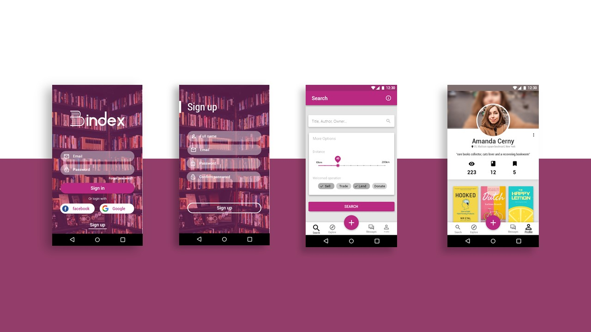

# Bindex

<p align="center"></p>

## Description
Bindex is a mobile app with a social media feel to it, where users can exchange, sell, lend or buy paper books and even form meaningfull connections with fellow readers.

## Wireframe

<details><summary style="color: #0645AD">Show more</summary>
<p>
```


```
</p>
</details>

## UI Design



## Technical overview
* __Programming language:__ Dart
* __Framework:__ Flutter
* __APIs:__ Google Firebase, Google Books API, Google Maps.

## Tools
* Balsamiq Mockups
* Adode Xd
* Android Studio

## Remark!
I'm remaking the thing
